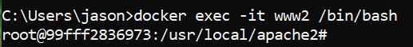

## Pre-requisite
- Docker for windows is installed and is running
- Some disk space for the images
- Decent internet connection
- Admin privilege 

## Using docker command line
### # Start a web server container image from docker.io
- Search and download httpd
``` bash
docker search httpd

docker pull docker.io/library/httpd
```

- Verify the image is downloaded
``` bash
docker images

docker inspect httpd:latest
```

- Start our very first web server container from the httpd image
``` bash
docker run --name www1 -p 8080:80 -d httpd
```

- Verify the container is running
``` bash
docker ps

```

- Let's surf to our very own web server
``` bash
curl http://localhost:8080
```

- Or simply open up a browser and point to http://localhost:8080

### # Start second container from the same httpd image but this time we change the web page content
``` bash
docker run --name www2 -p 8081:80 -d httpd
```

- Verify there are 2 web servers running
``` bash
docker ps 
```

- Check the www2's logs for any message
``` bash
docker logs www2
```

- Open up an interactive terminal to www2
``` bash
docker exec -it www2 /bin/bash
```

- You should see the prompt



- While still in the terminal, modify the index.html
``` bash
echo "Hello World!" > htdocs/index.html
exit
```

- Browse to http://localhost:8081

- The end of exercise


