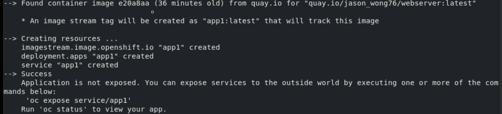

## Pre-requisite
- Access to previously built image on quay.io registry
- Access to an existing OpenShift cluster
- Min: Developer privilege

### Start our very own custom built webserver in OpenShift cluster
1. Log into openshift cluster
``` bash
oc login -u kubeadm -p <password>
```

2. Create new project
oc new-project jason-demo1

3. Create new deployment using the previously built image on quay.io registry
``` bash
oc new-app --name web1 quay.io/jason_wong76/webserver:latest
```



4. Verify the deployed application
``` bash
oc status
oc get pods
```
- Error due to restricted rules preventing the httpd map to port 80

5. Fix the issue
``` bash
oc create serviceaccount mysa
oc adm policy add-scc-to-user anyuid -z mysa
oc set serviceaccount deployment/web1 mysa
```

6. Verify pod is being re-built
``` bash
oc get pods -w
oc logs web1-<podname>
```

7. Expose the application
``` bash
oc expose svc web1
```
- Get the generated route

``` bash
oc get route
```
(images/route_hostname.png)


8. Access the web content
``` bash
curl http://web1.jason-demo1.apps.ocp4.example.com
```

- Or simply open the web page with browser

- End of exercise
