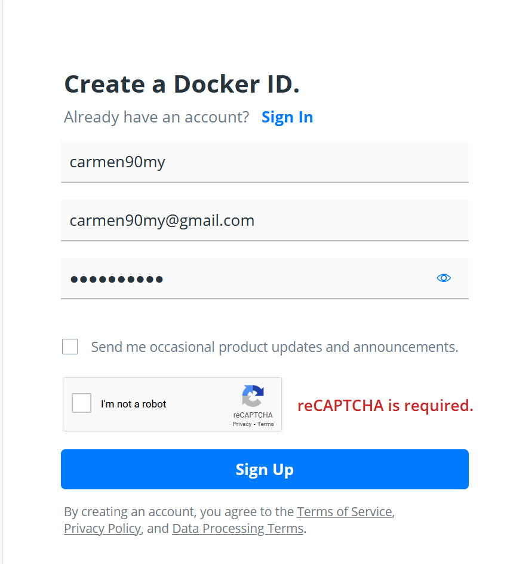
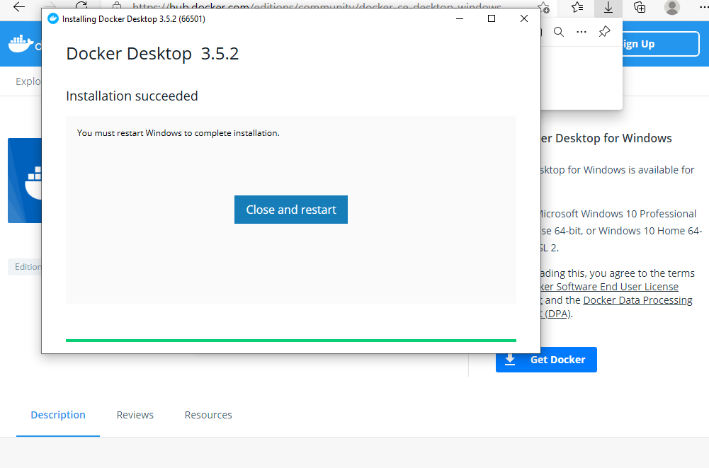

## Exercise 1 : Sign up with quay.io
1. Launch any browser
2. Goto https://quay.io
3. Click on TRY FOR FREE ON PREMISES
4. Click any Start Free Trial
 
- Use personal email
- Remember your url to quay.io

## Exercise 2 : Sign up with docker.io
1. Launch any browser
2. Goto https://docker.io
3. Click on Get Started (top right)
4. Under Docker Hub, click Signup
5. In the Create a Docker ID,  a
- Enter a prefer dockerID
- Enter your personal email address
- Assign a unique password 
- Click I'm not a robot --> answer simple puzzle
- Click Sign Up
-

6. Log into your personal email inbox
7. Open up mail sent by [Docker]
8. Click Verify email address
9. Login with the dockerID and password created earlier
- Continue with Docker for Desktop installation

## Exercise 3 : Install Docker Desktop
### Pre-requisite
- Administrator right to your PC
- Internet connection
- Some disk space < 1Gib
- Experience with command line interface - Not necessary but added bonus

1. Launch any browser of your preference

2. Google and download Docker Desktop for Windows

3. Launch the installer

4. Reboot your system

5. Once rebooted, launch Docker Desktop
- Let is start

